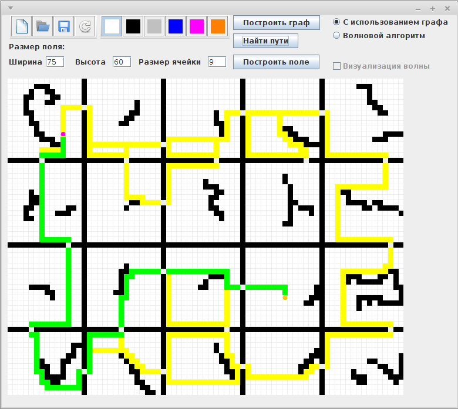
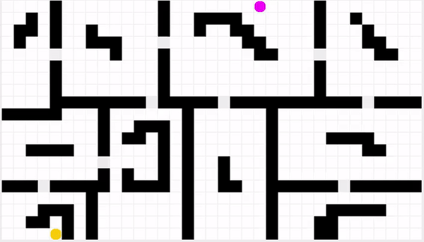

# Программа симуляции клетчатого лабиринта  
Программа позволяет находить оптимальные маршруты между двумя точками в клетчатом лабиринте.  
Написана на **Java**, среда разработки - NetBeans.  
Программа была создана в рамках научно-исследовательской работы в магистратуре. По результатам был сделан доклад на вузовской конференции. Слайды и тезисы также прилагаются в репозитории (папка *documents*).  
## Возможности:  
- задание произвольного лабиринта;  
- поиск пути волновым алгоритмом;  
- визуализация волнового алгоритма;  
- построение оптимальных маршрутов внутри комнат;  
- поиск пути по заранее построенным маршрутам с помощью алгоритма Дейкстры;  
- сохранение лабиринта в файл с возможностью последующей загрузки.  

## Требования:  
- **Java 8**.

  
  
   
Барашков А.А., 2017
